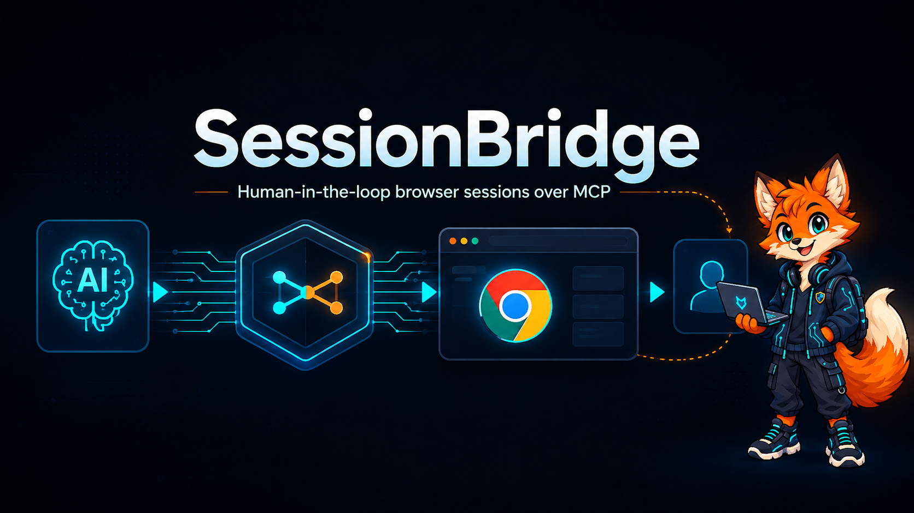

<div align="center">

# SessionBridge

Sessões visíveis e persistentes de navegador para clientes MCP, com intervenção humana quando necessário.


</div>

---

## O problema que resolve

Automações de navegador normalmente param quando encontram login, CAPTCHA, Cloudflare ou outra etapa que precisa de uma pessoa. SessionBridge mantém janela dedicada do Chrome aberta e mesma sessão ativa: cliente MCP navega, pessoa conclui etapa manual e workflow continua no mesmo contexto.

SessionBridge não resolve nem contorna proteções anti-bot. Ele oferece handoff controlado para interação humana.

## Como funciona

```text
┌──────────────────┐      MCP / stdio      ┌──────────────────┐
│ Cliente MCP / IA │ ────────────────────► │  SessionBridge   │
└──────────────────┘                       └────────┬─────────┘
                                                  │ Playwright + CDP
                                                  ▼
                                         ┌──────────────────┐
                                         │ Chrome dedicado  │◄──── Pessoa
                                         │ sessão persistente│
                                         └──────────────────┘
```

1. Cliente chama `open_browser` com URL HTTP(S).
2. SessionBridge abre ou reutiliza navegador dedicado.
3. Inspeção heurística classifica página como pronta ou dependente de interação manual.
4. Pessoa conclui etapa diretamente na janela visível.
5. `wait_for_human` ou `continue_session` verifica página novamente.
6. Cliente retoma workflow usando mesmas abas, cookies e autenticação.

Detalhes: [docs/architecture.md](docs/architecture.md).

## Recursos

- perfil persistente e isolado em `.chrome_profile`;
- conexão CDP restrita a `127.0.0.1:9222`;
- validação da identidade do endpoint antes de reutilizá-lo;
- detecção heurística de Cloudflare, Turnstile, CAPTCHA e textos de verificação;
- espera com timeout para conclusão de interação humana;
- leitura limitada de URL, título e texto visível;
- transporte MCP local via `stdio`.

## Início rápido

### Requisitos

- Windows;
- Python 3.11 a 3.13;
- Google Chrome, Microsoft Edge ou Brave.

### Instalação

```powershell
git clone https://github.com/Devzinh/sessionbridge.git
cd sessionbridge

python -m venv .venv
.\.venv\Scripts\python.exe -m pip install -e ".[test]"
```

### Executar servidor

```powershell
.\.venv\Scripts\python.exe server.py
```

Servidor usa MCP `stdio`; terminal permanece aguardando cliente.

## Configuração no Codex

Adicione ao `%USERPROFILE%\.codex\config.toml`:

```toml
[mcp_servers.sessionbridge]
command = "C:\\path\\to\\sessionbridge\\.venv\\Scripts\\python.exe"
args = ["C:\\path\\to\\sessionbridge\\server.py"]
```

Substitua caminho pelo clone local e reinicie Codex.

> Abra site, leia dados da página e aguarde se houver interação manual.

## Ferramentas MCP

| Ferramenta | Função |
| --- | --- |
| `open_browser(url)` | Valida URL, abre página e retorna estado inicial. |
| `get_browser_status()` | Retorna conexão, URL, título e necessidade de interação. |
| `wait_for_human(timeout_seconds)` | Aguarda página ficar pronta ou atingir timeout. |
| `continue_session()` | Reavalia imediatamente estado da página. |
| `get_current_page(max_length)` | Retorna URL, título e texto, limitado entre 1 e 100.000 caracteres. |
| `close_browser()` | Desconecta Playwright sem encerrar Chrome. |

## Testes

Suíte automatizada usa objetos simulados e não abre navegador:

```powershell
.\.venv\Scripts\python.exe -m pytest -q
```

Smoke test abre navegador instalado e acessa `https://example.com`:

```powershell
.\.venv\Scripts\python.exe scripts\smoke_test.py
```

## Segurança

- Endpoint CDP escuta somente em loopback.
- Perfil dedicado reduz mistura com sessão principal do navegador.
- Endpoint desconhecido na porta configurada é recusado.
- URLs precisam ser HTTP(S) absolutas, sem credenciais embutidas.
- Texto lido da página é devolvido ao cliente MCP; avalie fluxo antes de usar páginas sensíveis.

## Limitações atuais

- execução e descoberta de navegador focadas em Windows;
- detecção heurística pode gerar falso positivo ou não reconhecer prompt específico;
- sem clique, preenchimento, screenshot ou JavaScript arbitrário como ferramentas MCP;
- porta CDP fixa em `9222` no fluxo padrão;
- perfil dedicado preserva dados localmente entre execuções.

Problema comum? Consulte [docs/troubleshooting.md](docs/troubleshooting.md).

## Estrutura

```text
sessionbridge/
├── browser/        # lançamento, CDP, estado e sessão
├── tools/          # adaptadores das ferramentas MCP
├── scripts/        # smoke test com navegador real
├── tests/          # testes automatizados
├── docs/           # arquitetura e solução de problemas
├── server.py       # servidor FastMCP via stdio
└── pyproject.toml  # pacote e dependências
```

## Status

MVP funcional: servidor MCP via `stdio`, navegador dedicado, sessão persistente e handoff humano. Escopo atual prioriza navegação, inspeção de estado e leitura limitada de conteúdo.
